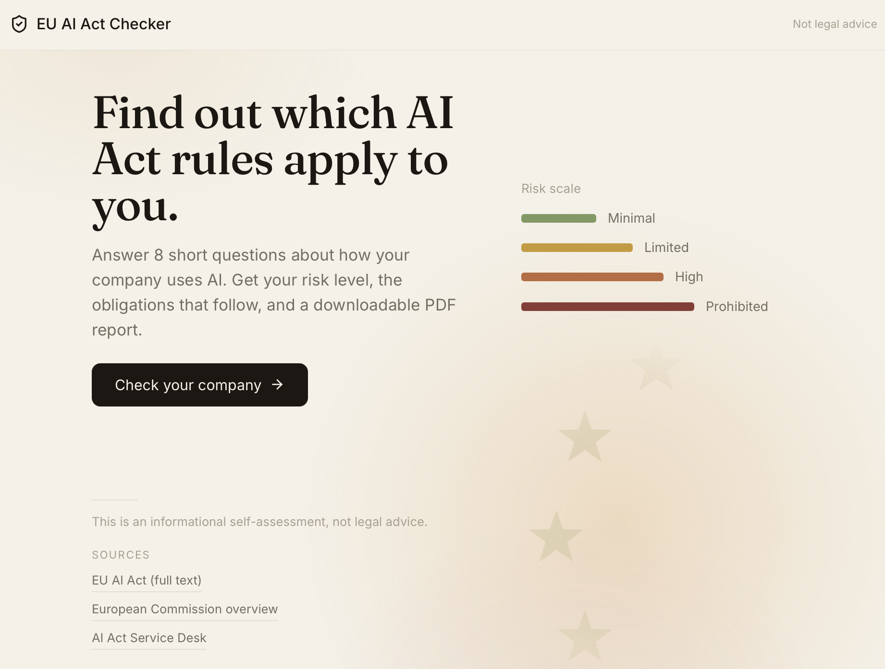

# EU AI Act Checker

[](https://github.com/sz012/eu-ai-act-checker/actions/workflows/ci.yml)

A web app that helps small businesses figure out which EU AI Act rules apply to them. You answer a few questions about how your company uses AI and get back the risk level of each system and what you actually need to do — plus a downloadable PDF report.

**Live demo - https://eu-ai-act-checker-pied.vercel.app**
Hosted on free tiers — the backend may take ~30–60 s to wake up on the first visit.

Why: the EU AI Act adds new obligations for companies using AI, with deadlines in 2026. Most small businesses have no idea where they stand, and the tools that exist are built for big corporations.

(!) Not legal advice. This is a simplified informational self-assessment. The risk mapping is intentionally simplified and the Act is still being amended.



## How it works

No machine learning. The "intelligence" is a deterministic rule set: an 8-question
questionnaire maps each AI use to a risk tier (minimal / limited / high / prohibited)
and to the obligations that follow. All of that legal knowledge lives in a single
module (`backend/app/rules.py`), so it is easy to audit and to update as the Act changes.

Answers are encoded in the results URL (`/results?y=q1,q4&m=q3`), so a result
survives a refresh and can be shared as a link. There is no database — nothing
about the user is stored.

## Tech stack

- **Frontend:** React (Vite) + react-router
- **Backend:** Python / FastAPI
- **PDF:** ReportLab
- **Tests:** pytest (backend) and Vitest + React Testing Library (frontend)
- **CI:** GitHub Actions
- No database — results are computed on the fly.

## Running locally

**Backend** (Python 3.12+):
```bash
cd backend
python3 -m venv .venv
.venv/bin/pip install -r requirements.txt
.venv/bin/uvicorn app.main:app --reload
```
API runs at `http://127.0.0.1:8000` (interactive docs at `/docs`).

**Frontend** (Node 20.19+, CI and development use Node 24):
```bash
cd frontend
npm install
npm run dev
```
App runs at `http://localhost:5173`.

## Running the tests

**Backend**
```bash
cd backend
.venv/bin/pytest
```

**Frontend**
```bash
cd frontend
npm test          
npm run test:watch
```
